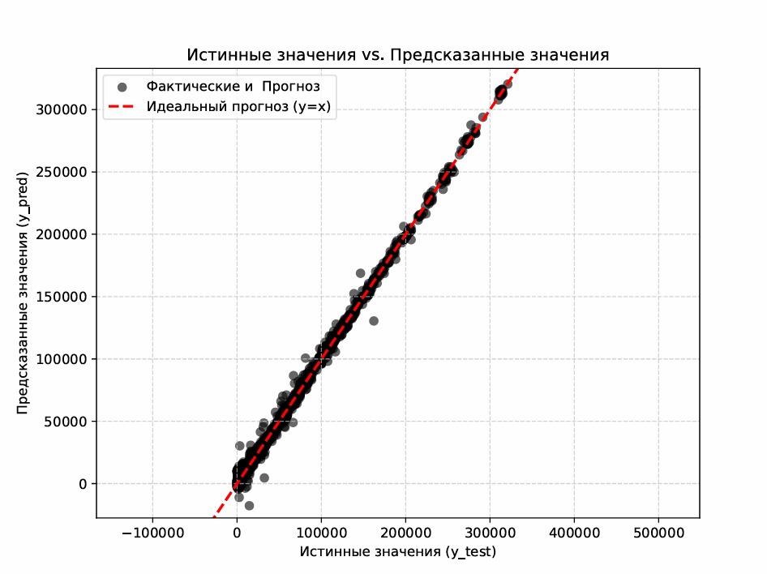
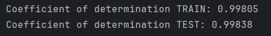
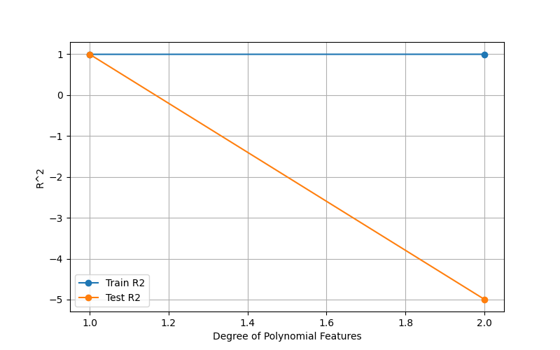
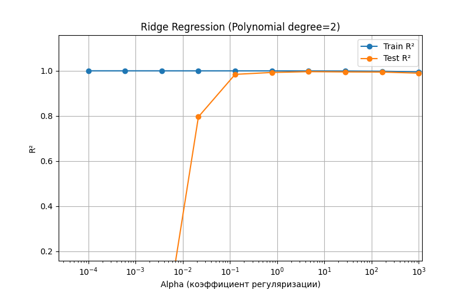
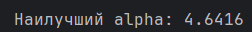

# Лабораторная работа 3. Линейная регрессия
## Задание
Перед выполнением лабораторной работы необходимо загрузить набор данных в соответствии с вариантом на диск

1. Написать программу, которая разделяет исходную выборку на обучающую и тестовую (training set, test set). Использовать стандартные функции (train_test_split и др. нельзя).
2. С использованием библиотеки scikit-learn обучить модель линейной регрессии по обучающей выборке пример
3. Проверить точность модели по тестовой выборке
4. Построить модель с использованием полиномиальной функции. Построить графики зависимости точности на обучающей и тестовой выборке от степени полиномиальной функции.
5. Построить модель с использованием регуляризации. На основе экспериментов подобрать параметры для регуляризации. Построить графики зависимости точности модели на обучающей и тестовой выборках от коэффициента регуляризации.
## Вариант 18
Gas Sensor Array Drift Dataset at Different Concentrations

## Загрузка dataset
```
from ucimlrepo import fetch_ucirepo
gas_sensor_array_drift_at_different_concentrations = fetch_ucirepo(id=270)

X_df = gas_sensor_array_drift_at_different_concentrations.data.features.copy()
y_df = gas_sensor_array_drift_at_different_concentrations.data.targets.copy()
```
X_df - Features, Признаки. y_df - Targets, Цели

## 1. Разделение исходной выборки на обучающую и тестовую в соотношении (20/80)
```
X, y = load_and_prepare_data()

# 1) Разделение на тестовую и обучающие выборки

# Общее количество образцов
n_samples = X.shape[0]

# Массив индексов от 0 до n_samples-1
indices = np.arange(n_samples)

# Перемешиваем индексы случайным образом
np.random.shuffle(indices)

# Применяем перемешанные индексы к X и y
X_shuffled = X.iloc[indices]
y_shuffled = y.iloc[indices]

# Разделяем перемешанные данные
train_size = int(n_samples * 0.8)

X_train = X_shuffled[:train_size]
X_test = X_shuffled[train_size:]

y_train = y_shuffled[:train_size]
y_test = y_shuffled[train_size:]

```
## 2. Модель линейной регрессии

С использованием библиотеки scikit-learn обучить модель линейной регрессии по обучающей выборке

Создаём объект model класса LinearRegression и применяем метод fit() для обучения модели.

Затем тестируем нашу модель на обучающей и тестовой выборке.

h(x) = w_0 + w_1x

w_new = w_old - aj(w_old)

```
from sklearn.linear_model import LinearRegression

regressor = LinearRegression().fit(X_train, y_train)

y_train_pred = regressor.predict(X_train)
y_test_pred = regressor.predict(X_test)
```





## 3. Проверить точность модели по тестовой выборке

Для оценки качества модели используются метрики. Они помогают понять, насколько хорошо модель справляется с задачей предсказания. Мы можем использовать две основные метрики: MSE и R².

MSE (среднеквадратичная ошибка) измеряет абсолютное среднее отклонение предсказаний от реальных значений. Она удобна для сравнения моделей, работающих с одними единицами измерения, но ее значение сильно зависит от масштаба данных и чувствительно к выбросам.

R² (коэффициент детерминации) – это нормированная метрика, показывающая, какую долю изменчивости целевой переменной модель смогла объяснить. R² всегда находится в диапазоне от минус бесконечности до 1, где 1 означает идеальное предсказание. Благодаря своей нормированности, R² позволяет сравнивать модели независимо от масштаба данных, что делает его универсальным инструментом оценки.

Остановимся на использовании метрики R2. Для оценки модели по выбранной метрике будем использовать стандартную функцию r2_score. 

```
from sklearn.metrics import mean_squared_error, r2_score

print(f"Coefficient of determination TRAIN: {r2_score(y_train, y_train_pred):.5f}")
print(f"Coefficient of determination TEST: {r2_score(y_test, y_test_pred):.5f}")
```


<p align="center">
  
</p>

## 4.Построить модель с использованием полиномиальной функции



```
from sklearn.pipeline import Pipeline
from sklearn.preprocessing import PolynomialFeatures

degrees = range(1, 3)
r2_train_list = []
r2_test_list = []

for degree in degrees:
   print(degree)
   pipeline = Pipeline([
       ("poly_features", PolynomialFeatures(degree=degree, include_bias=False)),
       ("linear_regression", LinearRegression())
   ])

   pipeline.fit(X_train, y_train)

   y_train_pred = pipeline.predict(X_train)
   y_test_pred = pipeline.predict(X_test)

   r2_train_list.append(r2_score(y_train, y_train_pred))
   r2_test_list.append(r2_score(y_test, y_test_pred))

plt.figure(figsize = (8,5))
plt.plot(degrees, r2_train_list, marker ='o', label = "Train R2")
plt.plot(degrees, r2_test_list, marker = 'o', label = "Test R2")
plt.xlabel("Degree of Polynomial Features")
plt.ylabel("R^2")
plt.legend()
plt.grid(True)
plt.show()
```
## 5. Построить модель с использованием регуляризации




```
degree = 2  
alphas = np.logspace(-4, 3, 10)  # коэффициенты регуляризации

r2_train_list = []
r2_test_list = []

for alpha in alphas:
    pipeline = Pipeline([
    ("poly", PolynomialFeatures(degree=degree, include_bias=False)),
    ("scaler", StandardScaler()),
    ("ridge", Ridge(alpha=alpha, max_iter=10000))
])

    # Обучаем модель на train
    pipeline.fit(X_train, y_train)

    # Предсказания
    y_train_pred = pipeline.predict(X_train)
    y_test_pred = pipeline.predict(X_test)

    # R^2
    r2_train_list.append(r2_score(y_train, y_train_pred))
    r2_test_list.append(r2_score(y_test, y_test_pred))

plt.figure(figsize=(8,5))
plt.semilogx(alphas, r2_train_list, marker='o', label="Train R^2")
plt.semilogx(alphas, r2_test_list, marker='o', label="Test R^2")
plt.xlabel("Alpha (коэффициент регуляризации)")
plt.ylabel("R^2")
plt.title(f"Ridge Regression (Polynomial degree={degree})")
plt.ylim(0,1)  # шаг 0.2 можно регулировать через plt.yticks
plt.grid(True)
plt.legend()
plt.show()

best_index = np.argmax(r2_test_list)
best_alpha = alphas[best_index]

print(f"Наилучший alpha: {best_alpha:.4f}")
```

<p align="center">
  
</p>
