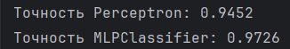
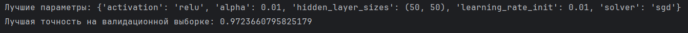
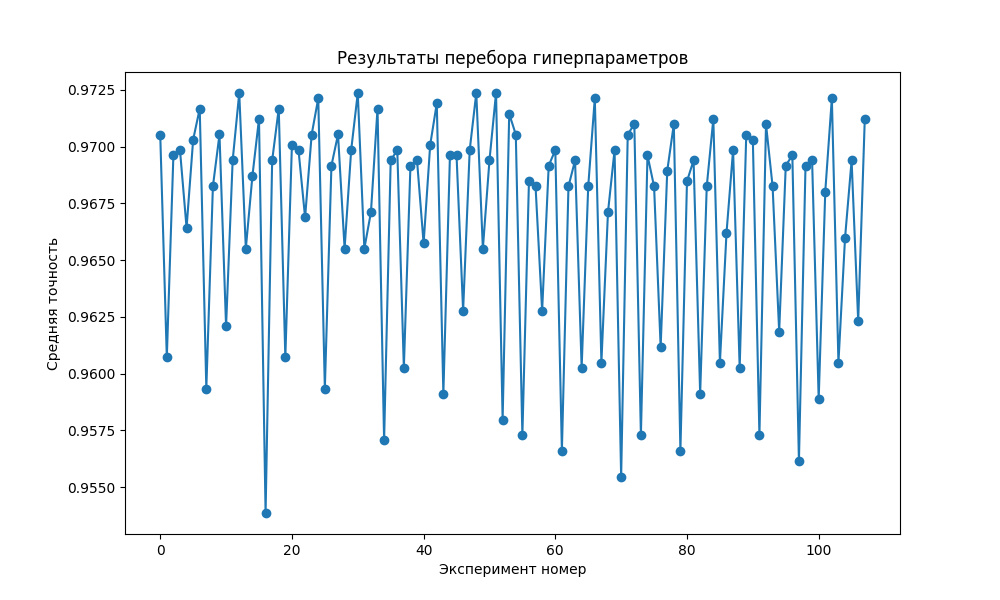

# Лабораторная работа 4. Основы нейронных сетей
## Задание
Перед выполнением лабораторной работы необходимо загрузить набор данных в соответствии с вариантом на диск

1. Написать программу, которая разделяет исходную выборку на обучающую и тестовую (training set, validation set, test set), если такое разделение не предусмотрено предложенным набором данных.
2. Произвести масштабирование признаков (scaling).
3. С использованием библиотеки scikit-learn обучить 2 модели нейронной сети (Perceptron и MLPClassifier) по обучающей выборке. Перед обучением необходимо осуществить масштабирование признаков. Пример MLPClassifier Пример и описание Perceptron
4. Проверить точность модели по тестовой выборке.
5. Провести эксперименты и определить наилучшие параметры коэффициента обучения, параметра регуляризации, функции оптимизации. Данные экспериментов необходимо представить в отчете (графики, ход проведения эксперимента, выводы).

## Вариант 18
Page Blocks Classification

## Загрузка dataset
```
from ucimlrepo import fetch_ucirepo
page_blocks_classification = fetch_ucirepo(id=78)

X = page_blocks_classification.data.features
y = page_blocks_classification.data.targets
```
## Разделение исходной выборки на обучающую и тестовую
```
X_train, X_test, y_train, y_test = train_test_split(
    X, y, test_size=0.2, random_state=42
)
```
## Масштабирование признаков

  Стандартизация данных (приведение к нулевому среднему и единичному стандартному отклонению) (метод масштабирования).

  X_train_scaled = scaler.fit_transform(X_train) — к обучающим данным применяется полная процедура: сначала вычисляются статистические параметры (среднее и стандартное отклонение) по обучающей выборке, затем данные преобразуются.

  X_test_scaled = scaler.transform(X_test) — к тестовым данным применяется только преобразование с использованием ранее вычисленных параметров (без пересчёта статистики).

  fit(X) — вычисляет параметры преобразования по данным X (для StandardScaler это среднее μ и стандартное отклонение σ для каждого признака).

  transform(X) — применяет преобразование к тем же данным X, используя вычисленные параметры.

  Масштабирование устраняет смещение из‑за разных единиц измерения, ускоряет обучение и повышает качество моделей, чувствительных к масштабу признаков.
```
scaler = StandardScaler()
X_train_scaled = scaler.fit_transform(X_train)
X_test_scaled = scaler.transform(X_test)
```
## Обучение Perceptron и MLPClassifier
```
perceptron = Perceptron(max_iter=1000, random_state=42)
perceptron.fit(X_train_scaled, y_train)
y_pred_perceptron = perceptron.predict(X_test_scaled)
accuracy_perceptron = accuracy_score(y_test, y_pred_perceptron)

mlp = MLPClassifier(max_iter=1000, random_state=42)
mlp.fit(X_train_scaled, y_train)
y_pred_mlp = mlp.predict(X_test_scaled)
accuracy_mlp = accuracy_score(y_test, y_pred_mlp)
```
## Проверка точности моделей
```
print(f"Точность Perceptron: {accuracy_perceptron:.4f}")
print(f"Точность MLPClassifier: {accuracy_mlp:.4f}")
```



## Гиперпараметры для эксперимента
hidden_layer_sizes - размеры скрытых слоев нейронной сети

activation - функция активации (relu — функция Rectified Linear Unit, tanh — гиперболический тангенс)

solver — алгоритм оптимизации (adam — адаптивный градиентный спуск, sgd — стохастический градиентный спуск)

alpha — коэффициент регуляризации

learning_rate_init — начальная скорость обучения
```
param_grid = {
    'hidden_layer_sizes': [(50,), (100,), (50,50)],
    'activation': ['relu', 'tanh'],
    'solver': ['adam', 'sgd', 'lbfgs'],
    'alpha': [0.0001, 0.001, 0.01],
    'learning_rate_init': [0.001, 0.01, 0.1]
}
```
## Подбор гиперпараметров для модели MLPClassifier с использованием метода перебора GridSearchCV
scoring='accuracy' -  метрика, по которой оценивается качество модели

cv=5 - стратегия кросс‑валидации (5‑fold). Данные делятся на 5 частей (фолдов). Для каждой комбинации гиперпараметров модель обучается 5 раз. каждый раз на 4 фолдах и валидируется на 1 оставшемся. Итоговый скор для комбинации — среднее из 5 валидационных скоров.

Зачем??? -  чтобы оценить обобщающую способность модели и избежать переобучения.

n_jobs=-1 - количество параллельных процессов для вычислений
```
grid_search = GridSearchCV(MLPClassifier(max_iter=1000, random_state=42),
                           param_grid,
                           scoring='accuracy',
                           cv=5,
                           n_jobs=-1)

grid_search.fit(X_train_scaled, y_train)
```
## Вывод лучших параметров
```
print("Лучшие параметры:", grid_search.best_params_)
print("Лучшая точность на валидационной выборке:", grid_search.best_score_)
```




## Визуализация

```
results = pd.DataFrame(grid_search.cv_results_)
scores_mean = results['mean_test_score']
params = results['params']

plt.figure(figsize=(10, 6))
plt.plot(scores_mean, marker='o')
plt.xlabel('Эксперимент номер')
plt.ylabel('Средняя точность')
plt.title('Результаты перебора гиперпараметров')
plt.show()
```



