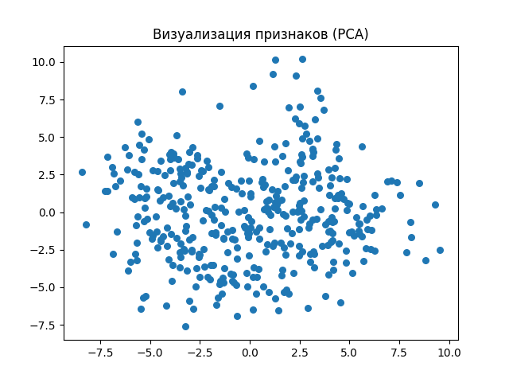

# Лабораторная работа 5. Алгоритмы кластеризации данных
## Задание
Перед выполнением лабораторной работы необходимо загрузить набор данных в соответствии с вариантом на диск.

1. Произвести масштабирование признаков (scaling).
2. С использованием библиотеки scikit-learn написать программу с использованием алгоритмов кластеризации данных, позволяющую разделить исходную выборку на классы, соответствующие предложенной вариантом задаче (http://scikit-learn.org/stable/modules/clustering.html).
3. Провести эксперименты и определить наилучший алгоритм кластеризации, параметры алгоритма. Необходимо использовать не менее 3-х алгоритмов. Данные экспериментов необходимо представить в отчете (графики, ход проведения эксперимента, выводы).
## Вариант 18
AAAI 2014 Accepted Papers (Принятые документы AAAI 2014)

## Загрузка dataset
```

```



