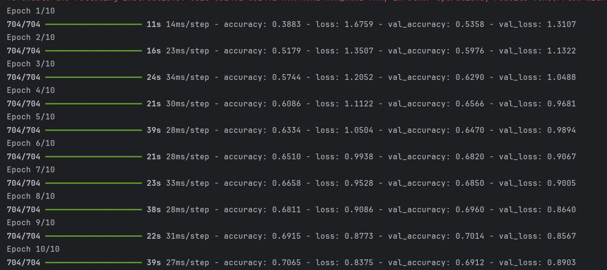
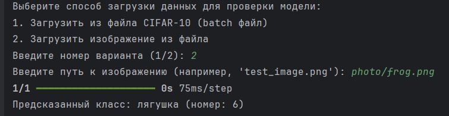
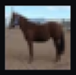
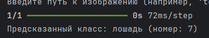
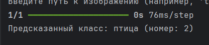
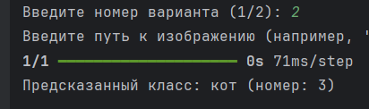
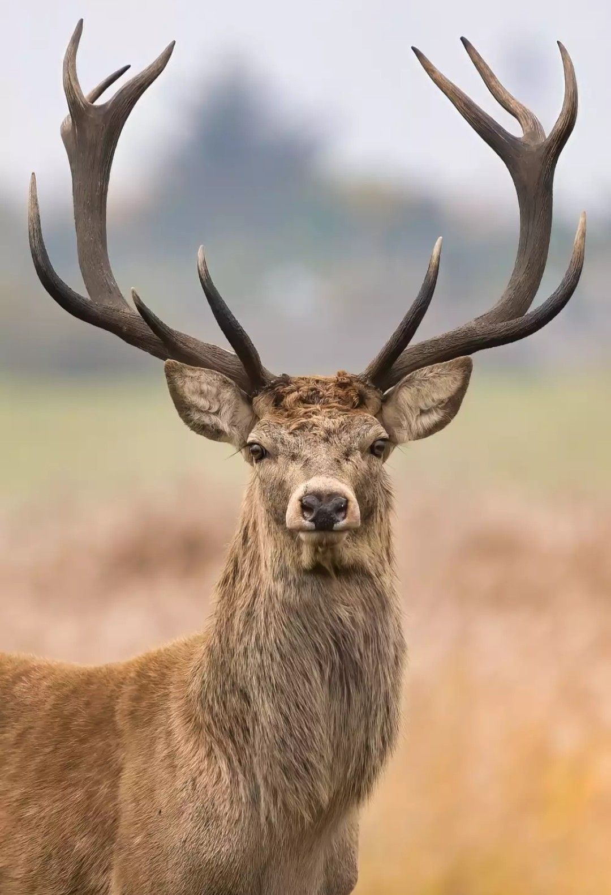
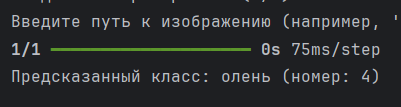
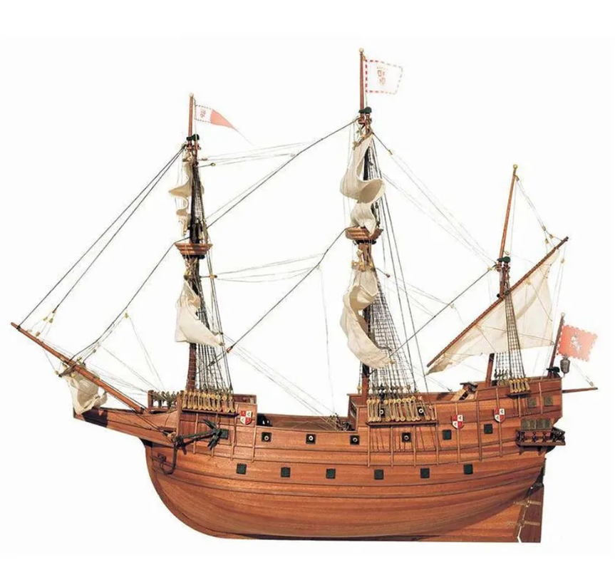
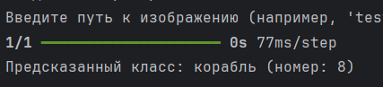

# Лабораторная работа №6.  Сверточные сети.
## Общее задание

Перед выполнением лабораторной работы необходимо загрузить набор данных в соответствии с вариантом на диск.
Наборы данных можно скачать по адресу http://deeplearning.net/datasets/, либо из любого другого источника, либо подготовить их самостоятельно.

1. С использованием библиотеки Keras загрузить обучающую выборку, создать модель сверточной сети, обучить ее на обучающей выборке, сохранить модель в файл.
2. Написать дополнительно программу, которая загружает модель из файла, и предоставляет возможность загрузить файл или данные любым иным способом, чтобы проверить точность классификатора.

## Набор данных
В качестве набора данных был использован The CIFAR-10 dataset https://www.cs.toronto.edu/~kriz/cifar.html

Набор данных CIFAR-10 состоит из 60 000 цветных изображений размером 32x32 в 10 классах, по 6000 изображений в каждом классе. В наборе 50 000 обучающих изображений и 10 000 тестовых изображений.

Набор данных разделён на пять обучающих пакетов и один тестовый пакет, в каждом из которых по 10 000 изображений. Тестовый пакет содержит ровно 1000 случайно выбранных изображений из каждого класса. Обучающие пакеты содержат остальные изображения в случайном порядке, но в некоторых обучающих пакетах может быть больше изображений из одного класса, чем из другого. Обучающие пакеты содержат ровно по 5000 изображений из каждого класса.

Архив содержит файлы data_batch_1, data_batch_2, ..., data_batch_5, а также test_batch. Каждый из этих файлов представляет собой «замороженный» объект Python, созданный с помощью cPickle. Такой файл можно вернуть в словарь.

## Загрузка данных
Функция возвращает:
data: массив изображений формы (10000, 32, 32, 3), где каждое изображение — это 32x32 пикселя с 3 цветными каналами.
labels: список меток классов для каждого изображения.

```
def load_cifar10_batch(file):
    with open(file, 'rb') as f:
        batch = pickle.load(f, encoding='bytes')
    data = batch[b'data']
    labels = batch[b'labels']
    data = data.reshape(10000, 3, 32, 32).transpose(0, 2, 3, 1)
    return data, labels
```
## Загрузка данных для всех батчей
train_data — массив изображений всех 50 тысяч обучающих примеров.
train_labels — массив меток, соответствующих каждому изображению.
```
path_to_cifar10 = 'cifar-10-batches-py/' 

train_data_list = []
train_labels_list = []

for i in range(1, 6):
    data, labels = load_cifar10_batch(f'{path_to_cifar10}data_batch_{i}')
    train_data_list.append(data)
    train_labels_list.extend(labels)

train_data = np.concatenate(train_data_list)
train_labels = np.array(train_labels_list)

```
## Предобработка данных
/ 255.0 — нормализует значения пикселей, переводя их из диапазона [0, 255] в диапазон [0, 1]. Это стандартная практика, которая помогает ускорить обучение и повысить стабильность модели.
to_categorical — это функция из библиотеки Keras, которая преобразует целочисленные метки классов в "одномерное" бинарное представление (one-hot encoding).

```
train_data = train_data.astype('float32') / 255.0
train_labels = to_categorical(train_labels, num_classes=10)
```
## Создание модели
```
def create_cnn_model():
    model = Sequential()
    model.add(Conv2D(32, (3, 3), activation='relu', input_shape=(32, 32, 3)))
    model.add(MaxPooling2D((2, 2)))
    model.add(Conv2D(64, (3, 3), activation='relu'))
    model.add(MaxPooling2D((2, 2)))
    model.add(Flatten())
    model.add(Dense(128, activation='relu'))
    model.add(Dropout(0.5))
    model.add(Dense(10, activation='softmax'))
    return model

model = create_cnn_model()
model.compile(loss='categorical_crossentropy', optimizer='adam', metrics=['accuracy'])
```
1.	Входной слой:
o	input_shape=(32, 32, 3) — изображение размера 32x32 с 3 каналами (цветное RGB).
2.	Первый сверточный слой:
o	Conv2D(32, (3, 3), activation='relu') — применяет 32 фильтра размера 3x3, использует функцию активации ReLU.
3.	Первый слой подвыборки (макс pooling):
o	MaxPooling2D((2, 2)) — уменьшает размер изображения вдвое по каждой оси.
4.	Второй сверточный слой:
o	Conv2D(64, (3, 3), activation='relu') — применяет 64 фильтра, чуть более глубокий уровень.
5.	Второй слой подвыборки:
o	Еще один MaxPooling2D((2, 2)).
6.	Выравнивание:
o	Flatten() — преобразует двумерные данные в один вектор для подачи на полносвязные слои.
7.	Полносвязный слой:
o	Dense(128, activation='relu') — слой из 128 нейронов с ReLU.
8.	Dropout:
o	Dropout(0.5) — регуляризация для предотвращения переобучения; отключает случайные нейроны с вероятностью 50%.
9.	Выходной слой:
o	Dense(10, activation='softmax') — слой из 10 нейронов для классификации 10 классов CIFAR-10, использует softmax.

## Обучение модели
```
model.fit(train_data, train_labels, epochs=10, batch_size=64, validation_split=0.1)


```

## Сохранение модели
```
model.save('cnn_cifar10_model.h5')
print("Модель сохранена в файл 'cnn_cifar10_model.h5'.")
```
## Загрузка сохранённой модели
```
model = load_model('cnn_cifar10_model.h5')
```
## Загрузка данных из файла CIFAR-10
```
def load_cifar10_batch(file):
    with open(file, 'rb') as f:
        batch = pickle.load(f, encoding='bytes')
    data = batch[b'data']
    labels = batch[b'labels']
    data = data.reshape(10000, 3, 32, 32).transpose(0, 2, 3, 1)
    return data, labels
```
## Функция предобрабл=отки данных
```
def preprocess_data(data):
    data = data.astype('float32') / 255.0
    return data
```
## Функция для оценки модели на новых данных
```
def evaluate_data(data, labels):
    data = preprocess_data(data)
    labels_categorical = to_categorical(labels, num_classes=10)
    loss, accuracy = model.evaluate(data, labels_categorical, verbose=0)
    print(f'Точность модели: {accuracy:.4f}')
```
## Загрузка изображения из файла и вывод класса

```
img = load_img(image_path, target_size=(32, 32))

img_array = img_to_array(img)

# Расширяем размерность для предсказания

 img_array = np.expand_dims(img_array, axis=0)

# Предобработка

img_array = preprocess_data(img_array)

# Предсказание

 prediction = model.predict(img_array)

predicted_class_index = np.argmax(prediction)

 # Названия классов CIFAR-10
class_names = ['самолёт', 'автомобиль', 'птица', 'кот', 'олень',

                           'собака', 'лягушка', 'лошадь', 'корабль', '']

 predicted_class_name = class_names[predicted_class_index]
print(f"Предсказанный класс: {predicted_class_name} (номер: {predicted_class_index})")
```

## Тестирование





















